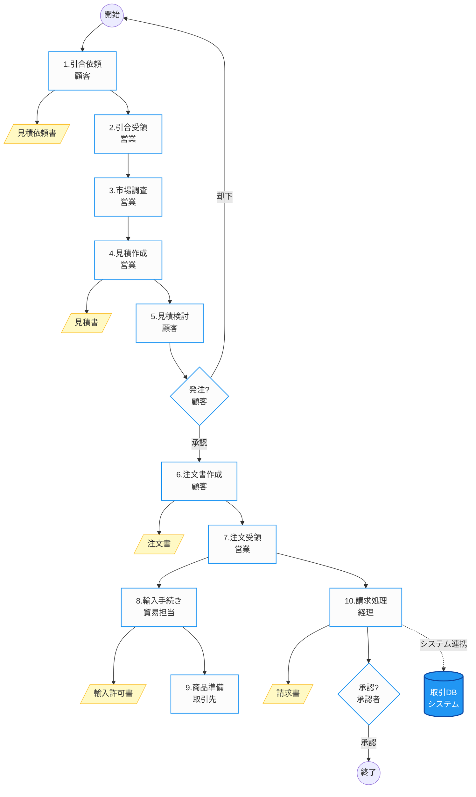

# 商社トレーディング業務フロー - Mermaid記法

## フロー図

## 主な接続関係

- **顧客** → **営業**: 引合依頼の送信
- **営業** → **顧客**: 見積書の提出
- **顧客**の発注判断: 却下の場合は開始に戻る
- **顧客** → **営業**: 注文書の送信
- **営業** → **貿易担当**・**経理**: 並行処理
- **貿易担当** → **取引先**: 商品準備依頼
- **経理** → **システム**: 取引DB連携（点線）
- **承認者**の承認後 → 終了

## 元ファイル情報

- 元SVGファイル: `business-flow-2025-07-23T16-45-30.svg`
- 作成日: 2024年
- 業務: 商社トレーディング業務フロー