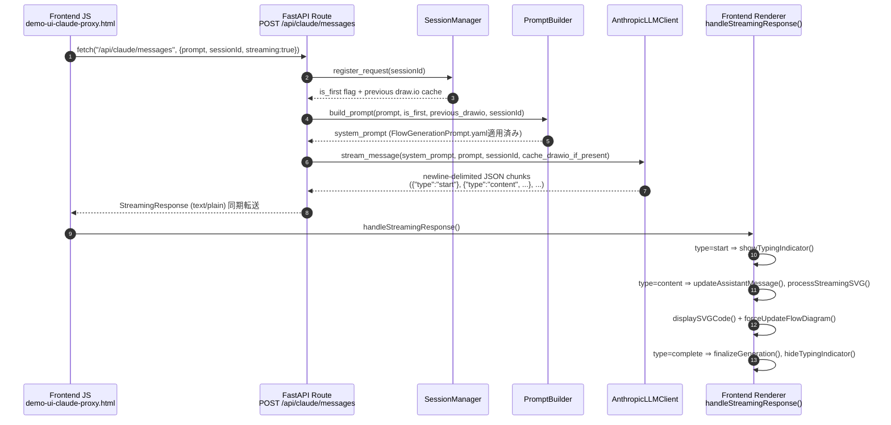

```mermaid
sequenceDiagram
    autonumber
    participant FrontJS as Frontend JS<br/>demo-ui-claude-proxy.html
    participant API as FastAPI Route<br/>POST /api/claude/messages
    participant Session as SessionManager
    participant Builder as PromptBuilder
    participant LLM as AnthropicLLMClient
    participant FrontUI as Frontend Renderer<br/>handleStreamingResponse()

    FrontJS->>API: fetch("/api/claude/messages", {prompt, sessionId, streaming:true})
    API->>Session: register_request(sessionId)
    Session-->>API: is_first flag + previous draw.io cache
    API->>Builder: build_prompt(prompt, is_first, previous_drawio, sessionId)
    Builder-->>API: system_prompt (FlowGenerationPrompt.yaml適用済み)
    API->>LLM: stream_message(system_prompt, prompt, sessionId, cache_drawio_if_present)
    LLM-->>API: newline-delimited JSON chunks<br/>({"type":"start"}, {"type":"content", ...}, ...)
    API-->>FrontJS: StreamingResponse (text/plain) 同期転送
    FrontJS->>FrontUI: handleStreamingResponse()
    FrontUI->>FrontUI: type=start ⇒ showTypingIndicator()
    FrontUI->>FrontUI: type=content ⇒ updateAssistantMessage(), processStreamingSVG()
    FrontUI->>FrontUI: displaySVGCode() + forceUpdateFlowDiagram()
    FrontUI->>FrontUI: type=complete ⇒ finalizeGeneration(), hideTypingIndicator()
```
