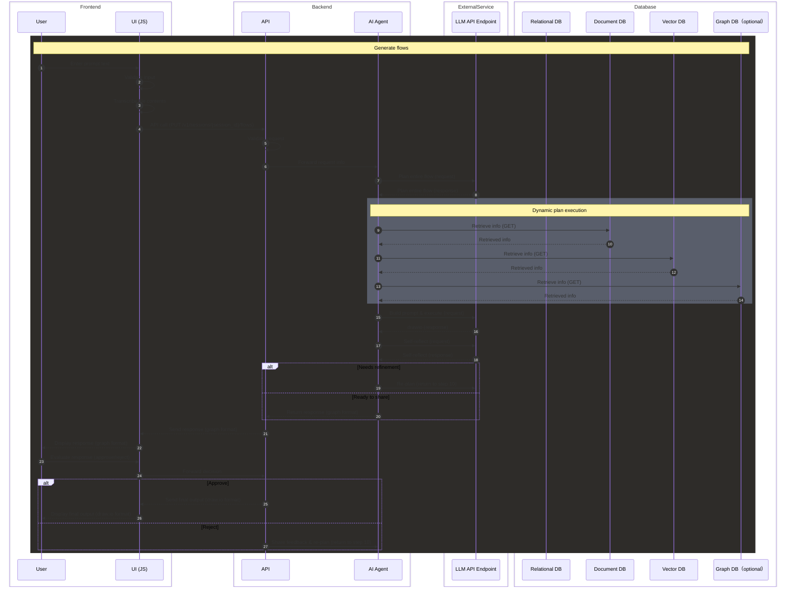

```mermaid
sequenceDiagram
    autonumber
    box Frontend
        participant User as User
        participant UI as UI (JS)
    end
    box Backend
        participant API as API
        participant Logic as AI Agent
    end
    box ExternalService
        participant LLMAPI as LLM API Endpoint
    end
    box Database
        participant RelationalDB as Relational DB
        participant DocumentDB as Document DB
        participant VectorDB as Vector DB
        participant GraphDB as Graph DB（optional）
    end
    
    rect rgba(46, 44, 41, 1)
        Note over User,GraphDB: Generate flows
        User->>UI: Enter prompt text
        UI->>UI: Validate input
        UI->>UI: Transcribe file contents
        UI->>API: API call (PUT /v1/sessions/{session_id}/flows)
        API->>API: Validate request
        API->>Logic: Forward request info
        Logic->>LLMAPI: Plan entire flow (request)
        LLMAPI-->>Logic: Plan entire flow (response)
        rect rgba(89, 94, 107, 1)
            Note over Logic,GraphDB: Dynamic plan execution
            Logic->>DocumentDB: Retrieve info (GET)
            DocumentDB-->>Logic: Retrieved info
            Logic->>VectorDB: Retrieve info (GET)
            VectorDB-->>Logic: Retrieved info
            Logic->>GraphDB: Retrieve info (GET)
            GraphDB-->>Logic: Retrieved info
        end
        Logic->>LLMAPI: Build prompt & execute (request)
        LLMAPI-->>Logic: drawio (response)
        Logic->>LLMAPI: Self-reflect (request)
        LLMAPI-->>Logic: Self-reflect (response)
        alt Needs refinement
            Logic->>LLMAPI: Re-plan (return to step 10)
        else Ready to share
            Logic-->>API: Return response (graph format)
        end
        API-->>UI: Send response (graph format)
        UI-->>User: Display response (graph format)
        User->>UI: Evaluate response (approve/reject)
        UI->>API: Forward decision
        alt Approve
            API-->>UI: Send final output (draw.io format)
            UI-->>User: Display final output (draw.io format)
        else Reject
            API->>Logic: Share feedback & re-plan (return to step 10)
        end
    end
```
