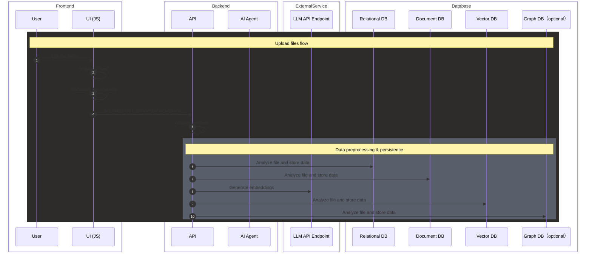

```mermaid
sequenceDiagram
    autonumber
    box Frontend
        participant User as User
        participant UI as UI (JS)
    end
    box Backend
        participant API as API
        participant Logic as AI Agent
    end
    box ExternalService
        participant LLMAPI as LLM API Endpoint
    end
    box Database
        participant RelationalDB as Relational DB
        participant DocumentDB as Document DB
        participant VectorDB as Vector DB
        participant GraphDB as Graph DB（optional）
    end
    rect rgba(46, 44, 41, 1)
        Note over User,GraphDB: Upload files flow
        User->>UI: Upload file(s)
        UI->>UI: Validate input
        UI->>UI: Transcribe file contents
        UI->>API: API call (POST /v1/user/{user_id}/files)
        API->>API: Validate request
        rect rgba(89, 94, 107, 1)
            Note over API,GraphDB: Data preprocessing & persistence
            API->>RelationalDB: Analyze file and store data
            API->>DocumentDB: Analyze file and store data
            API->>LLMAPI: Generate embeddings
            API->>VectorDB: Analyze file and store data
            API->>GraphDB: Analyze file and store data
        end
    end
    
```
